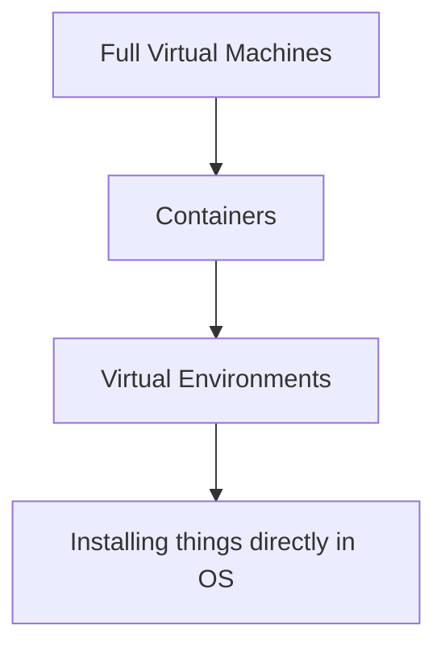

# RSE Lessons Learned

<small>René Fritze</small>

<small>rene.fritze@wwu.de</small>

<small>Mathematics Münster</small>

<small>November 22, 2022</small>

<small>*WWU RSExpress 2022*</small>

---

# About

---

### Me

- C++/Python dev for 13+ yrs
- Lots of random infrastructure projects
- [on github](https://github.com/renefritze/)
- [pyMOR](https://pymor.org)
- [MaRDI](https://www.mardi4nfdi.de/about/mission)

---

### This talk

- Opinionated
- Not ordered
- Has a link to itself on the last slide

---

# Use version control

---

### Use version control

1. Commit often
2. Commit run scripts
3. Commit results
4. Use tags to mark events

---

# Pin your environments

---

## Use containers

1. Pretty good reproduceability
2. Document the install + run procedures
3. Lots of services know how to run containers

---

### But what about venv, Julia Pkg, conda-env

- Dependencies disappear from the internet
- Break with OS updates
- Package manager updates break things too

---



---

# Document your work

---

1. *You* will not understand your own code in a year
2. For code: *Why* not *what*
3. Dev journal: keep a log of things you tried to fix bug,
  ways to implement a certain feature

---

# Automate the boring stuff

---

## Test your code

---

### Test your code I

1. Already have your env in containers
2. Easy to run containers in Gitlab CI
3. No excuse left not to automatically run tests

---

### Test your code II

1. Start with the dumbest validation example
2. Run this on every commit.
3. Testing libraries have tools to make regression tests easy:<br/>
   Record a truth value in the repo, get a diff when results change

---

## Project templates with Cookiecutter

---

### Cookiecutter

1. Written in Python:<br/>
  ```python -m pip install cookiecutter```

2. Asks a bunch of questions:<br/>
  ```cookiecutter some_repo.git```
3. Does text replacement with the answers as input
4. Project ready

---

### Examples

- [For this presentation](https://github.com/renefritze/cookiecutter-reveal-md)
- [WWU-beamer presentations](https://zivgitlab.uni-muenster.de/ag-ohlberger/rene.fritze/wwu_presentation_cookiecutter)
- [GitHub topic](https://github.com/topics/cookiecutter-template)

---

## Automatic code formatting

- "Code is more often read than written"
- Esp in collab projects everybody's looking the same is invaluable
- Doesn't matter how the code looks, only that it's always the same style
- Even CMake has an auto-formatter

---

## Pre-commit hooks I

- Flexible framework to run all sorts of checks and scripts before commiting changes
- Lots of pre-made ones available
- Easy to extend
- Integrates nicely into CI pipelines

---

## Pre-commit hooks I

I use them to:
Apply code formatting, check for too large files,

---

# Death by ~~PowerPoint~~ TeX-Beamer

---

### In short

1. One message per slide
2. Dark background
3. Most important Content == Largest font
4. No more than 6 things on a slide
5. Use contrast to steer focus

---

### In long

<https://www.youtube.com/watch?v=Iwpi1Lm6dFo>

---

<div class="container">

<div>

## Get the slides

[https://rene.fritze.me/22-wwu-rsexpress/](https://rene.fritze.me/22-wwu-rsexpress/)

</div>

<div>

</div>
</div>
