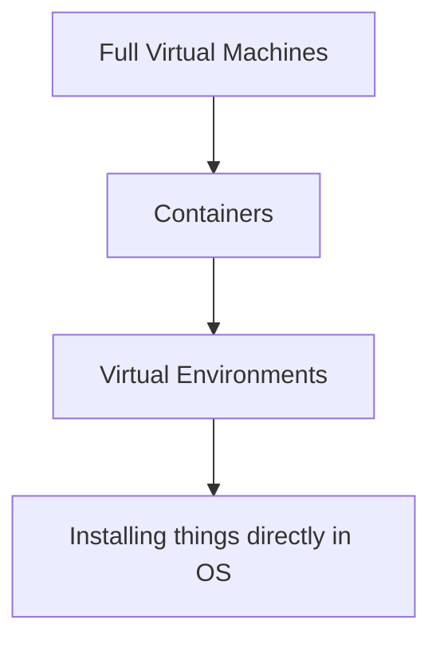

# RSE Lessons Learned

<small>René Fritze</small>

<small>rene.fritze@wwu.de</small>

<small>Mathematics Münster</small>

<small>November 22, 2022</small>

<small>*WWU RSExpress 2022*</small>

---

# About

---

### Me

- C++/Python dev for 13+ yrs<!-- .element: class="fragment" data-fragment-index="0" -->
- Lots of random infrastructure projects<!-- .element: class="fragment" data-fragment-index="1" -->
- [on github](https://github.com/renefritze/)<!-- .element: class="fragment" data-fragment-index="2" -->
- [pyMOR](https://pymor.org)<!-- .element: class="fragment" data-fragment-index="3" -->
- [MaRDI](https://www.mardi4nfdi.de/about/mission)<!-- .element: class="fragment" data-fragment-index="4" -->

---

### This talk

- Opinionated <!-- .element: class="fragment" data-fragment-index="0" -->
- Not ordered <!-- .element: class="fragment" data-fragment-index="1" -->
- Has a link to itself on the last slide <!-- .element: class="fragment" data-fragment-index="2" -->

---

# Use best practices from the beginning

---

### best practices

1. Much easier to follow than establish<!-- .element: class="fragment" data-fragment-index="0" -->
2. "I'll add tests later" is a lie<!-- .element: class="fragment" data-fragment-index="1" -->
3. Starting late will screw with your git history<!-- .element: class="fragment" data-fragment-index="2" -->
4. Onboarding new people much more straightforward<!-- .element: class="fragment" data-fragment-index="3" -->

---

# Use version control

---

### Use version control

1. Commit often<!-- .element: class="fragment" data-fragment-index="0" -->
2. Commit run scripts<!-- .element: class="fragment" data-fragment-index="1" -->
3. Commit results<!-- .element: class="fragment" data-fragment-index="2" -->
4. Use tags to mark events<!-- .element: class="fragment" data-fragment-index="3" -->

---

# Pin your environments

---

## Use containers

1. Pretty good reproduceability<!-- .element: class="fragment" data-fragment-index="0" -->
2. Document the install + run procedures<!-- .element: class="fragment" data-fragment-index="1" -->
3. Integrates seamlessly with IDEs like pyCharm, Clion, VSCode<!-- .element: class="fragment" data-fragment-index="2" -->
4. Lots of services know how to run containers<!-- .element: class="fragment" data-fragment-index="3" -->
5. Immutability is key<!-- .element: class="fragment" data-fragment-index="4" -->

---

### But what about venv, Julia Pkg, conda-env

- Dependencies disappear from the internet<!-- .element: class="fragment" data-fragment-index="0" -->
- Break with OS updates<!-- .element: class="fragment" data-fragment-index="1" -->
- Package manager updates break things too<!-- .element: class="fragment" data-fragment-index="2" -->

---

### Ordered from most to least robust



---

# Document your work

---

### Document your work

1. You will not understand your own code in a year<!-- .element: class="fragment" data-fragment-index="0" -->
2. For code: Why not what<!-- .element: class="fragment" data-fragment-index="1" -->
3. Dev journal: keep a log of things you tried to fix a bug,
  ways to implement a certain feature.<!-- .element: class="fragment" data-fragment-index="2" -->

  [Gold standard example](https://til.simonwillison.net/)<!-- .element: class="fragment" data-fragment-index="3" -->


---

# Automate the boring stuff

---

## Test your code

---

### Test your code I

1. Already have your env in containers<!-- .element: class="fragment" data-fragment-index="0" -->
2. Easy to run containers in (Gitlab) CI<!-- .element: class="fragment" data-fragment-index="1" -->
3. No excuse left not to automatically run tests<!-- .element: class="fragment" data-fragment-index="2" -->

---

### Test your code II

1. Start with the dumbest validation example<!-- .element: class="fragment" data-fragment-index="1" -->
2. Run this on every commit.<!-- .element: class="fragment" data-fragment-index="2" -->
3. Testing libraries have tools to make regression tests easy:<!-- .element: class="fragment" data-fragment-index="3" -->
<br/>
   Record a truth value in the repo, get a diff when results change<!-- .element: class="fragment" data-fragment-index="4" -->
4. Rerun tests on a weekly schedule<!-- .element: class="fragment" data-fragment-index="5" -->

---

## Project templates with Cookiecutter

---

### Cookiecutter

1. Written in Python:<!-- .element: class="fragment" data-fragment-index="0" -->
  ```python -m pip install cookiecutter```<!-- .element: class="fragment" data-fragment-index="1" -->

2. Asks a bunch of questions:<!-- .element: class="fragment" data-fragment-index="2" -->
  ```cookiecutter some_repo.git```<!-- .element: class="fragment" data-fragment-index="3" -->
3. Does text replacement with the answers as input<!-- .element: class="fragment" data-fragment-index="4" -->
4. Project with best practice setup ready<!-- .element: class="fragment" data-fragment-index="5" -->

---

### Examples

- [For this presentation](https://github.com/renefritze/cookiecutter-reveal-md)
- [WWU-beamer presentations](https://zivgitlab.uni-muenster.de/ag-ohlberger/rene.fritze/wwu_presentation_cookiecutter)
- [GitHub topic](https://github.com/topics/cookiecutter-template)

---

## Automatic code formatting

- "Code is more often read than written"<!-- .element: class="fragment" data-fragment-index="0" -->
- Esp in collab projects everybody's looking the same is invaluable<!-- .element: class="fragment" data-fragment-index="1" -->
- Doesn't matter how the code looks, only that it's always the same style<!-- .element: class="fragment" data-fragment-index="2" -->
- Even CMake has an auto-formatter<!-- .element: class="fragment" data-fragment-index="3" -->

---

## Pre-commit hooks I

- Flexible framework to run all sorts of checks and scripts before commiting changes<!-- .element: class="fragment" data-fragment-index="0" -->
- Lots of pre-made ones available<!-- .element: class="fragment" data-fragment-index="1" -->
- Easy to extend<!-- .element: class="fragment" data-fragment-index="2" -->
- Integrates nicely into CI pipelines<!-- .element: class="fragment" data-fragment-index="3" -->

---

## Pre-commit hooks I

I use them to:
Apply code formatting, check for too large files, avoid commiting credentials or broken symlinks...

---

## More automation examples

<https://rene.fritze.me/22-rse-day>

---

# Death by ~~PowerPoint~~ TeX-Beamer

---

### In short

1. One message per slide<!-- .element: class="fragment" data-fragment-index="0" -->
2. Dark background<!-- .element: class="fragment" data-fragment-index="1" -->
3. Most important Content == Largest font<!-- .element: class="fragment" data-fragment-index="2" -->
4. No more than 6 things on a slide<!-- .element: class="fragment" data-fragment-index="3" -->
5. Use contrast to steer focus<!-- .element: class="fragment" data-fragment-index="4" -->

---

### In long

<https://www.youtube.com/watch?v=Iwpi1Lm6dFo>

---

<div class="container">

<div>

## Get the slides

[https://rene.fritze.me/22-wwu-rsexpress/](https://rene.fritze.me/22-wwu-rsexpress/)

</div>

<div>

</div>
</div>
